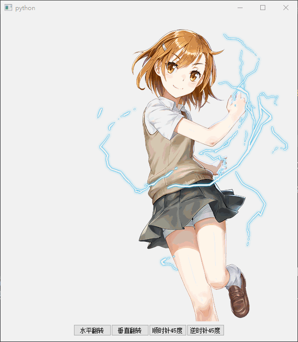
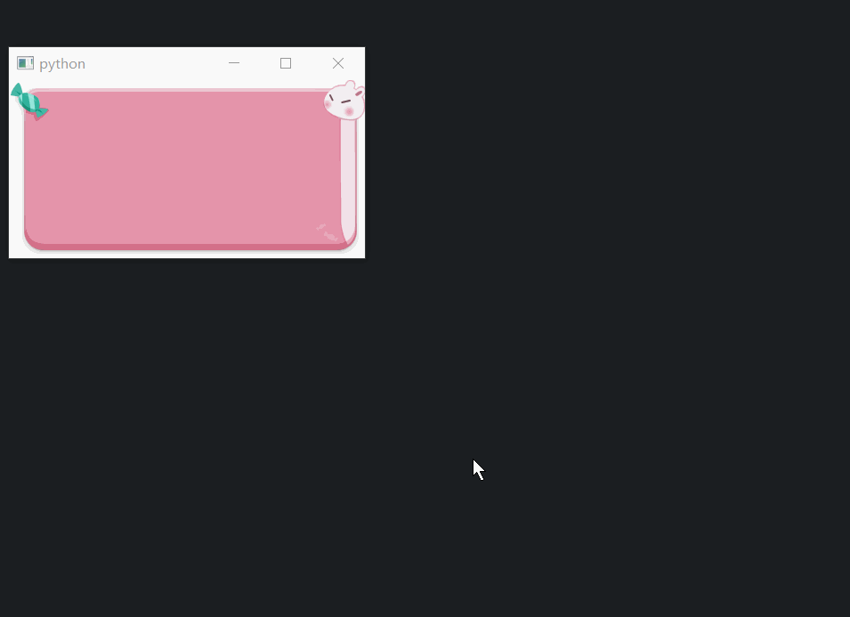

# QLabel

## 1、图片加载显示
[运行 ShowImage.py](ShowImage.py)

通过3种方式加载图片文件和显示gif图片

1. 通过`QPixmap("xxx.jpg")`加载
2. 通过`pyrcc5`转换res.qrc为res_rc.py文件，可以直接import加载
    1. 转换命令`pyrcc5 res.qrc -o res_rc.py`
    2. `import res_rc`
    3. 此时可以通过`QPixmap(":/images/head.jpg")`来加载
3. 通过rcc命令转成为二进制文件res.rcc
    1. 转换命令`Tools/rcc.exe -binary res2.qrc -o res.rcc`
    2. 这里把资源前缀修改下(/myfile),见res2.qrc文件
    3. 通过`QResource.registerResource("res.rcc")`注册
    4. 此时可以通过`QPixmap(":/myfile/images/head.jpg")`来加载
4. 通过xpm数组加载
    1. 通过工具`Tools/Image2XPM.exe`来转换
    2. 这里把转换的xpm数组直接放到py文件中当做一个变量
    3. 见xpmres.py中的image_head
    4. 此时可以通过`QPixmap(image_head)`来加载
    5. 通过`QMovie`加载gif图片


## 2、图片旋转
[运行 ImageRotate.py](ImageRotate.py)

1. 水平翻转 `QImage.mirrored(True, False)`
2. 垂直翻转 `QImage.mirrored(False, True)`
3. 旋转90的整数倍使用`QTransform`比较友好
4. 任意角度采用`QPainter.rotate`



## 3、仿网页图片错位显示
[运行 ImageSlipped.py](ImageSlipped.py)

1. 设置`setMouseTracking(True)`开启鼠标跟踪
2. 重写`mouseMoveEvent`鼠标移动事件获取偏移量
3. 重写`paintEvent`事件绘制图片


## 4、显示.9格式图片（气泡）
[运行 NinePatch.py](NinePatch.py) | [运行 QtNinePatch.py](QtNinePatch.py) | [运行 QtNinePatch2.py](QtNinePatch2.py)

什么叫.9.PNG呢，这是安卓开发里面的一种特殊的图片
这种格式的图片在android 环境下具有自适应调节大小的能力。

（1）允许开发人员定义可扩展区域，当需要延伸图片以填充比图片本身更大区域时，可扩展区的内容被延展。

（2）允许开发人员定义内容显示区，用于显示文字或其他内容

目前手机QQ中很多漂亮的的聊天气泡就是.9格式的png图片

在Github开源库中搜索到两个C++版本的

1.一个是NinePatchQt https://github.com/Roninsc2/NinePatchQt

2.一个是QtNinePatch https://github.com/soramimi/QtNinePatch

### For PyQt
1、目前针对第一个库在2年前用Python参考源码重新写一个见 `Lib/NinePatch.py`

2、这次针对第二个库用Python编写的见`Lib/QtNinePatch2.py`。用C++编写的pyd版本见`Lib/QtNinePatch`目录

### 说明
1、建议优先使用pyd版本的（后续提供Python3.4 3.5 3.6 3.7 编译好的32为库文件），也可以自行编译，编译步骤见下文。

2、其次可以使用Python写的第二个版本`Lib/QtNinePatch2.py`（个人觉得方便调用）

3、最后再考虑第一个版本吧

4、以上为个人意见，两个C++版本的写法不一样，但是核心算法应该是类似的。

### 自行编译

1、首先要安装好Qt、PyQt5、编译安装对应的sip、对应的VC++编译工具

2、用Qt Creator 打开pro文件进行编译

3、进入源码中的sip文件夹

4、修改`configure.py`文件

```python
# 这里是你的VC版本和对应的Qt目录中的文件夹
config.platform = "win32-msvc2010"
qt_path = 'D:/soft/Qt/Qt5.5.1/5.5/msvc2010'
```

5、`python configure.py`

