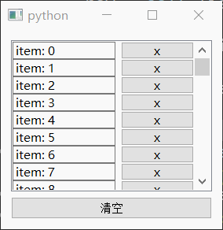

# QListView

- 目录
  - [删除自定义Item](#1删除自定义Item)
  - [自定义可拖拽Item](#2自定义可拖拽Item)
  - [腾讯视频热播列表](#3腾讯视频热播列表)

## 1、删除自定义Item
[运行 DeleteCustomItem.py](DeleteCustomItem.py)

1. 删除item时先要通过`QListWidget.indexFromItem(item).row()`得到它的行数
2. 通过`takeItem`函数取出该Item并删除掉,`item = self.listWidget.takeItem(row)`
3. 移除item对应的自定义控件`self.listWidget.removeItemWidget(item)`
4. 如果是清空所有Item，可以通过循环删除，但是删除的时候行号一直是0即可，原因和删除list数组一样。

## 2、自定义可拖拽Item
[运行 DragDrop.py](DragDrop.py)

## 3、腾讯视频热播列表
[运行 HotPlaylist.py](HotPlaylist.py)

简单思路说明：

 - 利用`QListWidget`设置一些特殊的参数达到可以横向自动显示
 - `QNetworkAccessManager`异步下载网页和图片
 - 滚动到底部触发下一页加载

自定义控件说明：

 - 主要是多个layout和控件的结合，其中图片`QLabel`为自定义，通过`setPixmap`设置图片，重写`paintEvent`绘制底部渐变矩形框和白色文字
 - 字体颜色用qss设置
 - 图标利用了`QSvgWidget`显示，可以是svg 动画（如圆形加载图）

`QListWidget`的参数设置

1. `setFlow(QListWidget.LeftToRight)`
2. `setWrapping(True)`
3. `setResizeMode(QListWidget.Adjust)`

