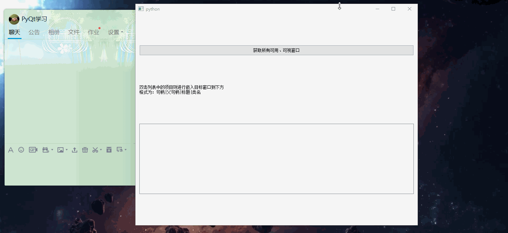
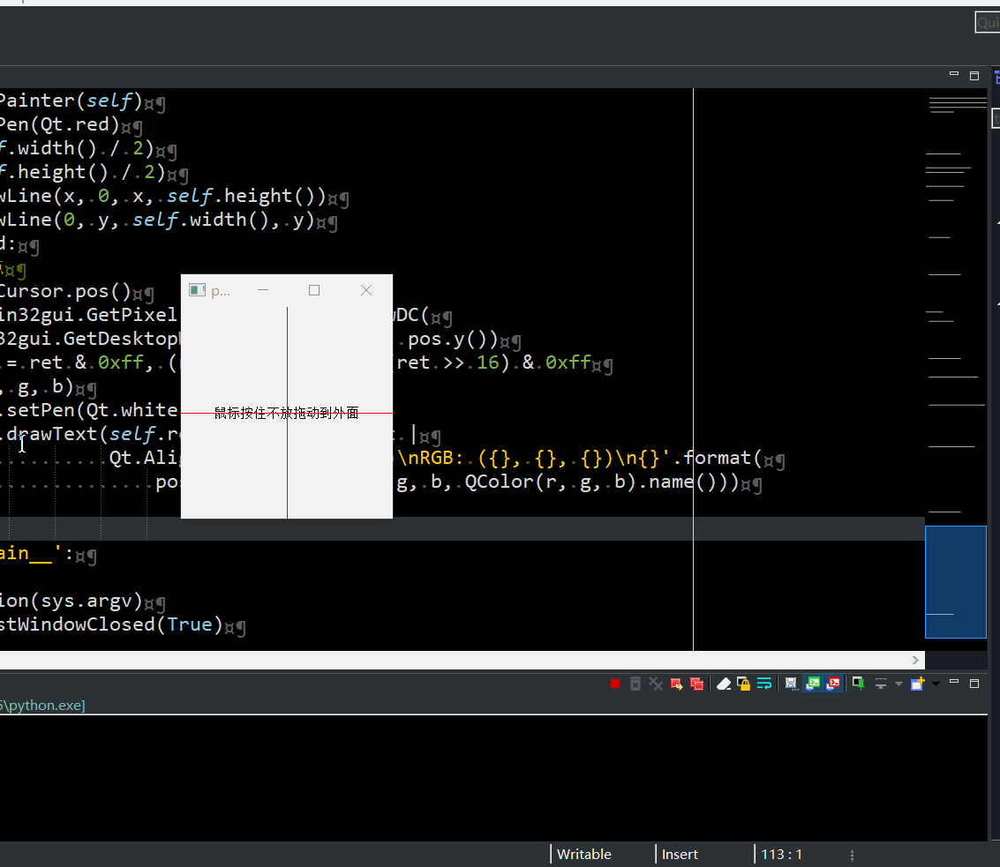

# 窗口案例

## [1、重启窗口Widget](窗口重启.py)

利用类变量对窗口的变量进行引用，防止被回收（导致窗口一闪而过），重启时先显示新窗口后关闭自己

## [2、分割窗口的分割条重绘](分割窗口的分割条重写.py)

1. 原理在于QSplitter在创建分割条的时候会调用createHandle函数
1. 通过重新写createHandle返回自己的QSplitterHandle类
1. 通过QSplitterHandle的paintEvent实现绘制其它形状，
1. 重写mousePressEvent和mouseMoveEvent来实现鼠标的其它事件

## [3、简单的窗口贴边隐藏](简单的窗口贴边隐藏.py)

1. 大概思路
    1. 思路是当窗口进入左边，顶部，右边一半时，此时判断窗口的坐标
    1. 如果窗口的x坐标小于0 则需要隐藏到左边
    1. 如果窗口的y坐标小于0 则需要隐藏到顶部
    1. 如果窗口的x坐标大于屏幕宽度-窗口宽度/2 则需要隐藏到右边

2. 事件说明
    1. mousePressEvent，鼠标按下事件，主要记录按下的坐标
    1. mouseMoveEvent，鼠标移动事件，用于移动窗口
    1. mouseReleaseEvent，鼠标弹起事件，用于判断是否需要隐藏窗口
    1. enterEvent，鼠标进入事件，用于窗口隐藏后，是否需要暂时显示预览
    1. leaveEvent，鼠标离开事件，用于窗口暂时显示后自动隐藏效果
 
## [4、嵌入外部窗口](嵌入外部窗口.py)

1. 使用SetParent函数设置外部窗口的parent为Qt的窗口
1. Qt使用QWidget.createWindowContainer(QWindow.fromWinId(窗口ID))生成QWidget
1. 使用GetWindowLong得到原来窗口的样式属性（style = win32gui.GetWindowLong(hwnd, win32con.GWL_STYLE)和exstyle = win32gui.GetWindowLong(hwnd, win32con.GWL_EXSTYLE)）
1. 这里还原窗口后不会显示，用spy++发现没有了WS_VISIBLE样式（未解决）

## [5、简单跟随其它窗口](外部窗口跟随.py)

1. 利用win32gui模块获取目标窗口的句柄
1. 通过句柄获取目标窗口的大小位置，并设置自己的位置
1. 当句柄失效时关闭自己
1. 主要是检测时间，在10毫秒以下很流畅

## [6、简单探测窗口和放大截图](简单探测窗口和放大截图.py)

1. 利用win32gui模块获取鼠标所在位置的窗口大小(未去掉边框)和rgb颜色
1. 利用一个全屏的全透明鼠标穿透的窗口（目的在于绘制矩形框和截图）

## [7、消息对话框倒计时关闭](消息对话框倒计时关闭.py)

1. 通过继承QMessageBox实现倒计时关闭的对话框
1. QTimer定时器关闭窗口

## [8、无边框自定义标题栏窗口](无边框自定义标题栏窗口/)

1. 方式一（QWidget）

    1. 使用一个QWidget（FramelessWindow）作为父窗口, 一个TitleBar作为标题栏, 一个QWidget作为底部容器
    1. 父窗口FramelessWindow设置为背景透明，但是需要绘制一定宽度的透明度很高的矩形边框用来接受鼠标事件（变形鼠标样式进行调整窗口大小）
    1. TitleBar的最小化最大化关闭等按钮事件关联到父窗口里
    1. TitleBar中的鼠标按下移动事件得到坐标也传递到父窗口调用move方法进行窗口移动

1. 方式二（windows api）

    1. 使用win32gui设置薄边框
    1. 重写nativeEvent事件拦截边框的系统边框的显示，并返回各个方向

## 截图

