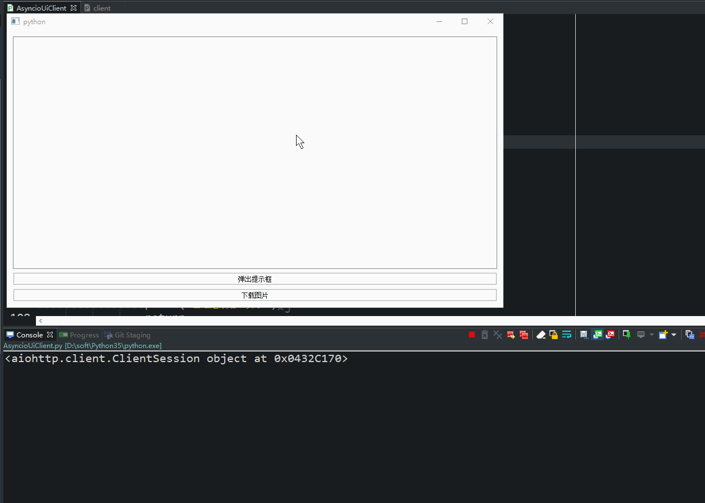

# asyncio结合PyQt例子

### [Python3.5][PyQt5]

依赖库：
    quamash（对QT事件循环的封装替换）：https://github.com/harvimt/quamash
    asyncio：https://docs.python.org/3/library/asyncio.html
    aiohttp：https://aiohttp.readthedocs.io/en/stable/

1、在创建QApplication后随即设置替换事件循环loop
```python
app = QApplication(sys.argv)
loop = QEventLoop(app)
asyncio.set_event_loop(loop)
w = Window()
```

2、通过asyncio.ensure_future(函数(), loop=loop)来执行某个异步函数

Window　　→→　　initSession（初始化session）<br/>
　↓<br/>
　↓<br/>
下载按钮　　→→　　doDownload（执行_doDownload方法）<br/>
　　　　　　　　　　　↓<br/>
　　　　　　　　　　　↓<br/>
　　　　　　　　　　session.get（下载json数据进行解析）<br/>
　　　　　　　　　　　↓<br/>
　　　　　　　　　　　↓<br/>
添加到界面　　←←　　_doDownloadImage（对单张图片进行下载）

# 截图
